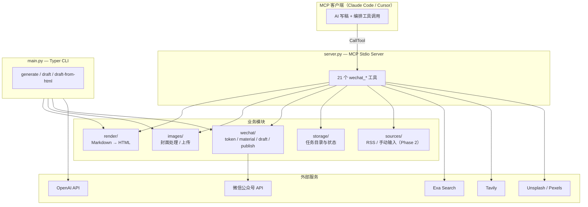
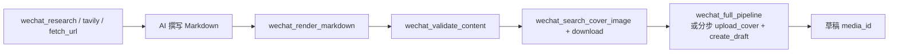

# wechat-ai-publisher

微信公众号 **AI 自动写作与草稿发布 MCP Server**。

Claude / Cursor 负责写稿与排版决策，本仓库提供 **资料检索、Markdown 渲染、图片处理、微信 API 调用** 等工具，把文章推送到公众号**草稿箱**，人工审核后再发布。

> **分支说明**：公众号 MCP 完整源码在 **`master`** 分支。若目录里只有 `quotation-mcp/`，请执行 `git checkout master` 切回本项目。

---

## 目录

- [项目定位](#项目定位)
- [架构总览](#架构总览)
- [目录结构](#目录结构)
- [两条使用路径](#两条使用路径)
- [MCP 工具一览](#mcp-工具一览)
- [排版模板](#排版模板)
- [微信 API 模块](#微信-api-模块)
- [本地任务存储](#本地任务存储)
- [环境变量](#环境变量)
- [快速开始](#快速开始)
- [CLI 命令](#cli-命令)
- [MCP 接入配置](#mcp-接入配置)
- [典型工作流](#典型工作流)
- [错误处理与安全](#错误处理与安全)
- [测试与文档](#测试与文档)
- [路线图](#路线图)

---

## 项目定位

| 维度 | 说明 |
|------|------|
| **输入** | 文章主题、Markdown 正文、封面图、元数据（标题/摘要/作者） |
| **输出** | 本地任务目录（MD/HTML/JSON）+ 微信草稿 `media_id` |
| **AI 分工** | 大模型写稿；MCP 负责渲染、上传、调微信 API |
| **发布策略** | 默认只创建草稿；推送给订阅者需显式开启 `ENABLE_AUTO_PUBLISH=true` |

核心流程：

```text
主题 / Markdown
    ↓
（可选）资料搜索 Exa / Tavily / 网页抓取
    ↓
Markdown → 微信兼容 HTML（inline style，4 套模板）
    ↓
封面压缩上传 → thumb_media_id
    ↓
草稿箱 draft/add → media_id
    ↓
公众号后台人工审核 → 发布
```

---

## 架构总览

### 系统分层



### CLI 全自动流水线（`main.py draft`）


### MCP 推荐流水线（AI 写稿 + 工具发布）



`wechat_full_pipeline` 内置**分步容错**：封面上传或建草稿失败时返回 `status: partial`，保留已生成的 HTML/路径，可单独重试后续步骤。

---

## 目录结构

```text
wechat-ai-publisher/
├── server.py              # MCP Server 入口（stdio）
├── main.py                # CLI：generate / draft / test-wechat
├── mcp_entry.py           # pip install 后的 MCP 入口
├── requirements.txt
├── pyproject.toml
├── .env.example
│
├── config/
│   ├── settings.py        # 环境变量读取与校验
│   └── style_config.yaml
│
├── ai/                    # CLI 模式：OpenAI 文章生成
│   ├── article_generator.py
│   ├── content_checker.py
│   ├── title_generator.py
│   └── image_prompt_generator.py
│
├── prompts/               # 系统 / 文章 / 标题 / 配图 prompt
├── style/
│   └── wechat-article-style.md   # 公众号写作风格（长期配置）
│
├── render/
│   ├── markdown_to_html.py       # Markdown → inline HTML
│   ├── templates.py              # A/B/C/D 四套模板样式
│   └── wechat_html_template.py   # 外层 wrapper
│
├── images/
│   ├── cover_processor.py        # 封面检查、压缩
│   └── image_uploader.py           # 上传封面 / 正文图
│
├── wechat/                # 微信官方 API 封装
│   ├── token.py           # access_token 缓存 + 重试
│   ├── material.py        # 永久素材 / 正文图片 uploadimg
│   ├── draft.py           # 草稿 CRUD
│   ├── publish.py         # 发布 + 状态查询（需 ENABLE_AUTO_PUBLISH）
│   ├── errors.py          # 错误码解析、限流检测
│   └── _session.py        # requests Session
│
├── storage/
│   └── task.py            # 任务目录、article.json、状态枚举
│
├── sources/               # Phase 2：RSS / we-mp-rss 素材
├── docs/                  # api_flow、部署、排错、MCP 配置
├── examples/              # mcp-config JSON 示例
├── tests/
└── storage/drafts/        # 运行时生成的任务产物（gitignore）
```

---

## 两条使用路径

| 路径 | 入口 | 适用场景 |
|------|------|----------|
| **MCP 模式** | `python server.py` | Claude/Cursor 对话中写稿，逐步或一键调工具 |
| **CLI 模式** | `python main.py draft --topic "..."` | 本地脚本一键：OpenAI 生成 + 建草稿 |

MCP 模式**不强制**走 OpenAI 生成模块——AI 客户端自己写 Markdown，再调 `wechat_render_markdown` / `wechat_full_pipeline`。

---

## MCP 工具一览

共 **22** 个工具，命名空间 `wechat_*`。

### 环境与连通性

| 工具 | 作用 |
|------|------|
| `wechat_health_check` | 检查 env、依赖、默认封面；可选 `check_wechat=true` 测 token |
| `wechat_test_connection` | 实际请求微信 API 验证 AppID/Secret/IP 白名单 |

### 资料收集（写稿前）

| 工具 | 作用 | 依赖 |
|------|------|------|
| `wechat_deep_research` | **服务端深度调研**：拆子问题 → 并行 Tavily+Exa 搜索去重 → AI 综合成带编号引用的报告。写文章类任务优先用这个——效果不依赖客户端自带的调研能力，换模型/客户端也一样 | `OPENAI_API_KEY` + (`TAVILY_API_KEY` 和/或 `EXA_API_KEY`，至少一个) |
| `wechat_research` | Exa 搜索，返回结构化摘要。适合单条信息查证 | `EXA_API_KEY` |
| `wechat_tavily_search` | Tavily 搜索最新资料。适合单条信息查证 | `TAVILY_API_KEY` |
| `wechat_fetch_url` | Scrapling 抓取网页正文 | 无（可选 stealth 绕 Cloudflare） |

### 图片

| 工具 | 作用 |
|------|------|
| `wechat_search_cover_image` | Unsplash/Pexels 搜封面候选 URL |
| `wechat_download_image` | URL → 本地 `storage/images/` |
| `wechat_upload_cover` | 本地封面 → 微信永久素材 → `thumb_media_id` |
| `wechat_upload_local_image` | 本地正文图 → 微信 CDN URL |
| `wechat_upload_body_image` | 搜索 + 下载 + 上传正文配图，返回 `` 片段 |

### 排版与质检

| 工具 | 作用 |
|------|------|
| `wechat_list_templates` | 列出 A/B/C/D 模板说明 |
| `wechat_render_markdown` | Markdown → 微信 HTML（可选 template） |
| `wechat_validate_content` | 发布前检查：长度、AI 口吻、占位符等 |

### 微信草稿与发布

| 工具 | 作用 |
|------|------|
| `wechat_create_draft` | 创建草稿 → `media_id` |
| `wechat_list_drafts` | 草稿箱列表 |
| `wechat_update_draft` | 更新已有草稿 |
| `wechat_delete_draft` | 删除草稿（不可撤销） |
| `wechat_publish` | 提交发布（需 `ENABLE_AUTO_PUBLISH=true`） |
| `wechat_get_publish_status` | 查询发布任务状态 |

### 一键与审计

| 工具 | 作用 |
|------|------|
| `wechat_full_pipeline` | Markdown + 封面 + 元数据 → 渲染 → 上传 → 建草稿 |
| `wechat_list_local_tasks` | 列出 `storage/drafts/` 历史任务，失败恢复与审计 |

---

## 排版模板

通过 `wechat_render_markdown` / `wechat_full_pipeline` 的 `template` 参数选择：

| ID | 风格 | 主色 | 适用 |
|----|------|------|------|
| **A** | 蓝色商业分析（默认） | `rgb(0,102,204)` | 商业分析、科技深度、行业报告 |
| **B** | 蓝色财经科普 | — | 财经科普 |
| **C** | 紫色新闻资讯 | — | 新闻资讯 |
| **D** | 钢蓝深度评论 | — | 深度评论 |

实现见 `render/templates.py`：全部 **inline style**，无外部 CSS，适配微信后台移动端阅读。

特性包括：H2 左边框、首行缩进（A）、数据对比 flex 卡片、图注样式等。

---

## 微信 API 模块

| 模块 | 端点 | 说明 |
|------|------|------|
| `token.py` | `GET /cgi-bin/token` | 内存缓存，过期前 60s 刷新，`tenacity` 重试 |
| `material.py` | `POST /cgi-bin/material/add_material` | 封面永久素材 |
| `material.py` | `POST /cgi-bin/media/uploadimg` | 正文图片 CDN |
| `draft.py` | `POST /cgi-bin/draft/add` | 创建草稿 |
| `draft.py` | `POST /cgi-bin/draft/batchget` | 列表 |
| `draft.py` | `POST /cgi-bin/draft/update` | 更新 |
| `draft.py` | `POST /cgi-bin/draft/delete` | 删除 |
| `publish.py` | `POST /cgi-bin/freepublish/submit` | 发布（受开关保护） |
| `publish.py` | `POST /cgi-bin/freepublish/getarticle` | 发布状态 |

详细时序见 [docs/api_flow.md](docs/api_flow.md)。

---

## 本地任务存储

每次运行创建独立目录：

```text
storage/drafts/2026-06-07-kimi-moonshot/
├── article.json          # 元数据、media_id、status
├── article.md
├── article.html
├── cover_processed.jpg   # 处理后封面
├── upload_result.json    # thumb_media_id
├── draft_result.json     # 草稿 API 响应
└── logs.txt
```

**状态枚举**：`generated` → `html_rendered` → `image_uploaded` → `draft_created` →（可选）`published`

`wechat_list_local_tasks` 可扫描历史任务，用于失败后从 `partial` 状态续跑。

---

## 环境变量

复制 `.env.example` 为 `.env`：

```bash
cp .env.example .env
```

| 变量 | 必填 | 说明 |
|------|------|------|
| `WECHAT_APP_ID` | ✅ MCP/CLI 建草稿 | 公众号 AppID |
| `WECHAT_APP_SECRET` | ✅ | AppSecret |
| `OPENAI_API_KEY` | CLI `generate`/`draft`，MCP `wechat_deep_research` | MCP 纯写稿模式（不用 deep_research）可不填 |
| `OPENAI_MODEL` | — | 默认 `gpt-4.1` |
| `EXA_API_KEY` | — | `wechat_research`、`wechat_deep_research`（二选一即可） |
| `TAVILY_API_KEY` | — | `wechat_tavily_search`、`wechat_deep_research`（二选一即可） |
| `UNSPLASH_ACCESS_KEY` | — | 封面搜索（二选一） |
| `PEXELS_API_KEY` | — | 封面搜索（二选一） |
| `DEFAULT_AUTHOR` | — | 默认 `2AIBot`（微信限 8 字） |
| `DEFAULT_COVER_PATH` | 建草稿推荐 | 默认封面本地路径 |
| `DEFAULT_SOURCE_URL` | — | 原文链接 |
| `ENABLE_AUTO_PUBLISH` | — | 默认 `false`，**强烈建议保持关闭** |

### 微信公众号后台配置

1. [微信公众平台](https://mp.weixin.qq.com) → 基本配置 → AppID / AppSecret  
2. **IP 白名单** → 加入运行 MCP 的机器公网 IP  
3. 确认「素材管理」「草稿箱」接口权限  

---

## 快速开始

```bash
git checkout master          # 确保在公众号 MCP 分支
python -m venv .venv
.venv\Scripts\activate       # Windows
pip install -r requirements.txt
cp .env.example .env         # 编辑填入密钥
```

验证微信配置：

```bash
python main.py test-wechat
```

启动 MCP Server：

```bash
python server.py
# 或 Windows: run_server.bat / .\start.ps1
```

推荐首次在 MCP 客户端中依次调用：

1. `wechat_health_check`（`check_wechat=false`）  
2. `wechat_test_connection`  

---

## CLI 命令

```bash
# 只生成本地 MD/HTML，不建草稿
python main.py generate --topic "人形机器人大脑赛道公司对比"

# 生成 + 上传封面 + 创建草稿
python main.py draft --topic "主题" --cover path/to/cover.jpg

# 已有 HTML 直接建草稿
python main.py draft-from-html --title "标题" --html storage/html/article.html --cover images/default_cover.jpg

# 测试 API
python main.py test-wechat
```

CLI 流水线会读取 `style/wechat-article-style.md` 作为长期写作风格配置。

---

## MCP 接入配置

详见 [docs/mcp_client_config.md](docs/mcp_client_config.md) 与 `examples/`。

**Windows 示例**（使用 venv 绝对路径）：

```json
{
  "mcpServers": {
    "wechat-ai-publisher": {
      "command": "D:/path/to/wechat-ai-publisher/.venv/Scripts/python.exe",
      "args": ["D:/path/to/wechat-ai-publisher/server.py"],
      "cwd": "D:/path/to/wechat-ai-publisher"
    }
  }
}
```

**安装包模式**：`pip install .` 后使用入口 `wechat-ai-publisher-mcp`。

---

## 典型工作流

### 工作流 D：深度调研写稿（推荐，写文章类任务默认走这条）

```text
1. wechat_deep_research(topic)                → 带编号引用的调研报告 report_markdown
2. （AI 基于报告撰写通俗版 Markdown + 标题 + 摘要，挑关键数据点保留来源）
3. wechat_search_cover_image / wechat_upload_body_image → 配图
4. wechat_audit_before_publish + wechat_save_sources    → 事实核查、来源留痕
5. wechat_full_pipeline                       → 草稿 media_id
6. 人工到公众号后台审核发布
```

判断标准：产出是**正式内容**（要发表、数据要经得起查）就走这条；只是想核实一条信息、抓一个链接这种轻量任务，直接用 `wechat_tavily_search` / `wechat_research`，不需要走完整调研流程。

### 工作流 A：AI 全权写稿 + 一键发草稿

```text
1. wechat_tavily_search / wechat_research     → 收集素材
2. （AI 撰写 Markdown + 标题 + 摘要）
3. wechat_validate_content                    → 质检
4. wechat_search_cover_image + download       → 封面
5. wechat_full_pipeline                       → 草稿 media_id
6. 人工到公众号后台审核发布
```

### 工作流 B：分步可控（适合调试）

```text
wechat_render_markdown → wechat_upload_cover → wechat_create_draft
```

任一步失败可单独重试，无需重跑全文。

### 工作流 C：CLI 无人值守

```bash
python main.py draft --topic "本周 AI 行业要闻解读"
```

---

## 错误处理与安全

### 常见微信错误

| 错误码 / 现象 | 原因 | 处理 |
|---------------|------|------|
| 40164 | IP 未加白名单 | 公众号后台添加服务器 IP |
| 40013 | AppID 无效 | 检查 `.env` |
| 45009 | 接口限流 | 稍后重试；`errors.is_rate_limit_error()` |
| 封面不存在 | 路径错误 | 检查 `DEFAULT_COVER_PATH` / `cover_path` |

更多见 [docs/troubleshooting.md](docs/troubleshooting.md)。

### 安全原则

- `.env` **禁止**提交 Git  
- 日志自动遮蔽 AppSecret  
- `ENABLE_AUTO_PUBLISH` 默认 `false`；`wechat_publish` 无开关则返回 blocked  
- 草稿创建后**必须人工审核**再发布  
- 不自动搬运他人公众号全文（PRD 合规要求）  

---

## 测试与文档

```bash
pytest tests/
```

| 文档 | 内容 |
|------|------|
| [docs/quickstart.md](docs/quickstart.md) | 最快上手 |
| [docs/api_flow.md](docs/api_flow.md) | API 调用链 |
| [docs/deployment.md](docs/deployment.md) | 部署 |
| [docs/troubleshooting.md](docs/troubleshooting.md) | 排错 |
| [docs/release_checklist.md](docs/release_checklist.md) | 发布检查清单 |
| [../prd.md](../prd.md) | 产品需求文档（Phase 1/2/3） |

---

## 路线图

### Phase 1（当前 · MVP）

- [x] MCP Server + 21 个工具  
- [x] Markdown → 微信 HTML（4 模板）  
- [x] 封面 / 正文图上传  
- [x] 草稿 CRUD + 可选发布  
- [x] CLI generate / draft  
- [x] 本地任务目录与 `wechat_list_local_tasks`  
- [x] Exa / Tavily / Scrapling 资料工具  

### Phase 2

- [ ] RSS / we-mp-rss 素材接入  
- [ ] 本地资料库 `knowledge_base/`  
- [ ] 自动选题（3–5 个候选）  
- [ ] AI 生成封面图  

### Phase 3

- [ ] 定时任务  
- [ ] Web 管理后台  
- [ ] 多公众号  
- [ ] 阅读数据分析反馈  

---

## License

Private / internal use.
